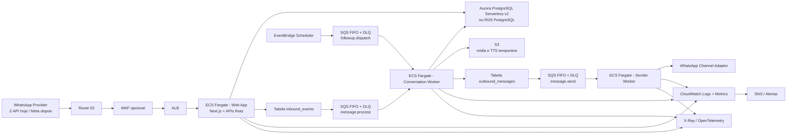
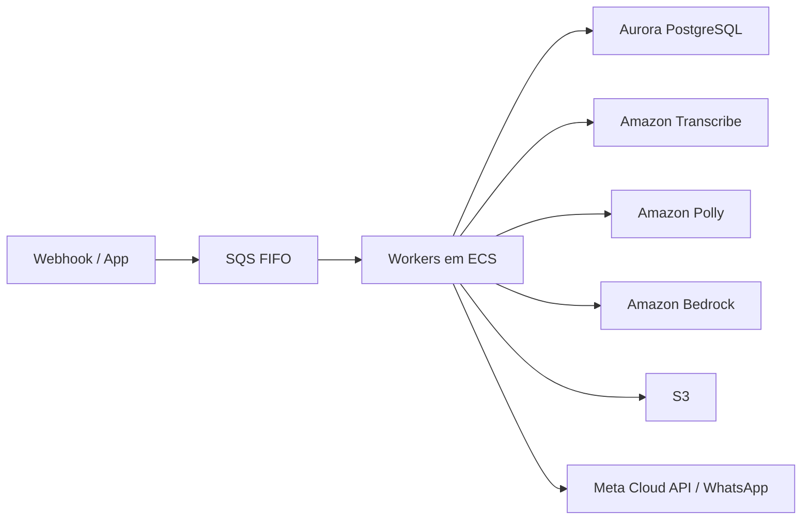

# Arquitetura AWS Alvo

Este documento descreve uma arquitetura AWS ideal para o SystemOps Core, buscando:

- latência mais previsível;
- menor risco de duplicação;
- melhor trilha de debug;
- separação clara entre entrada, processamento e envio;
- o menor número possível de serviços para não “microservicizar” cedo demais.

## Resposta curta

Sim, existe uma forma mais simples do que “quebrar tudo em muitos serviços”.

O desenho AWS mais saudável para este produto hoje não é o mais distribuído possível.

É este:

- app web em ECS/Fargate;
- banco em Aurora PostgreSQL Serverless v2 ou RDS PostgreSQL;
- fila SQS FIFO;
- workers em ECS/Fargate;
- agendamentos e atrasos via EventBridge Scheduler;
- mídia em S3;
- logs, traces e alertas em CloudWatch/X-Ray/SNS.

Eu evitaria neste estágio:

- EKS;
- Kafka;
- Redis obrigatório;
- Step Functions para tudo;
- outro repositório;
- dezenas de microserviços.

---

## Desenho recomendado

## O que cada bloco faz

### Web App

Responsabilidade:

- UI da clínica e owner;
- webhook;
- APIs finas;
- autenticação;
- persistir `inbound_events` ou mensagem inbound mínima;
- enfileirar trabalho.

Não deve:

- fazer a jornada inteira;
- esperar Whisper, TTS e LLM em sequência;
- enviar a resposta completa ao WhatsApp dentro da request.

### Conversation Worker

Responsabilidade:

- dedupe de negócio;
- carregar contexto;
- classificar intenção;
- aplicar regras determinísticas;
- chamar agenda;
- gerar `outbound_messages`;
- atualizar estado da conversa.

### Sender Worker

Responsabilidade:

- enviar texto, mídia e áudio;
- retryar falhas de canal;
- registrar `provider_message_id`;
- garantir ordem de envio por conversa.

### Follow-up Dispatcher

Responsabilidade:

- lembretes;
- reengajamento;
- tarefas atrasadas;
- publicar jobs agendados para o mesmo `conversation-worker`.

Na prática, eu não criaria um terceiro worker dedicado no dia 1.

Eu usaria `EventBridge Scheduler -> SQS -> conversation-worker`.

---

## Por que esse desenho faz sentido

### 1. Simplicidade real

Você continua com poucos blocos:

- web;
- banco;
- fila;
- workers;
- storage;
- observabilidade.

### 2. Separação de responsabilidade

- request web recebe;
- worker decide;
- sender entrega.

### 3. Ordem por conversa

Com `SQS FIFO`, você pode usar `conversationKey` como `messageGroupId`.

Isso ajuda a evitar:

- respostas fora de ordem;
- duplicações por corrida;
- estado inconsistente.

### 4. Debug melhor

Cada mensagem passa por estados claros:

- recebida;
- enfileirada;
- processada;
- pronta para envio;
- enviada;
- falhou.

### 5. Escala sem drama

Quando crescer, você escala workers antes de pensar em quebrar repositório ou produto.

### 6. Melhor trilha de debug

Cada salto importante deixa rastro persistido:

- `inbound_events`
- `messages`
- `outbound_messages`
- status da fila
- `provider_message_id`
- `traceId`

Isso responde muito mais rápido:

- a mensagem entrou?
- foi deduplicada?
- ficou presa no debounce?
- foi processada?
- foi colocada na outbox?
- foi enviada?
- o canal confirmou?

---

## O que eu não usaria logo de cara

### Step Functions como coração da conversa

Útil quando o fluxo é altamente visual, multi-etapas e distribuído.

Mas aqui ele pode virar complexidade de orquestração demais para uma jornada que ainda muda com frequência.

Eu manteria a lógica da conversa em código de worker, não em state machine externa da AWS.

### EKS

Poderoso, mas operacionalmente caro para este estágio.

Para este produto, ECS Fargate entrega quase tudo que importa com menos atrito.

### Kafka / MSK

Excelente para altíssimo throughput e múltiplos consumidores independentes.

Hoje é complexo demais para o problema.

### Redis como premissa

Só colocaria se surgirem requisitos claros de:

- cache quente muito intenso;
- rate limit distribuído super agressivo;
- sessões voláteis;
- throughput acima do que SQS + Postgres resolvem bem.

---

## Variante “mais AWS nativa”

Se a meta for reduzir dependência externa e concentrar tudo na AWS, a variação seria:

### Trocas nessa variante

- `Whisper` -> `Amazon Transcribe`
- `OpenAI TTS` -> `Amazon Polly`
- `OpenAI LLM` -> `Amazon Bedrock`

### Vantagem

- stack mais alinhado a compliance e procurement AWS;
- menos saída para terceiros;
- menos segredos espalhados.

### Desvantagem

- migração de prompts e qualidade;
- custo do áudio pode crescer rápido;
- tuning de comportamento pode mudar bastante.

Meu conselho: deixar a camada de IA adapter-based e não acoplar o domínio a um único provider.

---

## Estimativa de custo

## Premissas

Estimativa em `us-east-1`, mensal, com 30 dias.

Inclui:

- infraestrutura AWS principal;
- observabilidade básica;
- workers e fila.

Não inclui:

- impostos;
- custo do provedor WhatsApp;
- esforço de engenharia;
- custo variável de LLM se você continuar em OpenAI;
- WAF avançado com muitas regras gerenciadas.

## Dois jeitos de rodar isso na AWS

### Opção A: pragmática e mais barata

- ALB público
- tasks ECS com saída direta para internet
- banco privado
- sem NAT Gateway

Essa opção é a que eu usaria primeiro se a meta é:

- estabilizar rápido;
- reduzir custo fixo;
- separar webhook, processamento e envio;
- ganhar observabilidade já.

### Opção B: mais endurecida

- ALB público
- web e workers em subnets privadas
- saída para internet via NAT Gateway
- banco privado

Essa opção é melhor para hardening e governança, mas sobe bastante o custo fixo.

O principal motivo é simples: os workers ainda precisam sair para internet para falar com Z-API, OpenAI e outros providers.

Se eles estiverem em subnet privada, alguém precisa fazer essa saída. Normalmente esse alguém é o NAT Gateway.

## Preços de referência usados

- SQS Standard/FIFO: `1 milhão` de requests grátis; depois `US$ 0,40` standard e `US$ 0,50` FIFO por milhão.
- EventBridge Scheduler: `14 milhões` de invocações grátis; depois `US$ 1,00 / milhão`.
- Fargate Linux/ARM em us-east-1: `US$ 0,0000089944 / vCPU-seg` e `US$ 0,0000009889 / GB-seg`.
- ALB: `US$ 0,0225 / hora` mais LCU.
- Aurora Serverless v2 Standard: `US$ 0,12 / ACU-hora`.
- Aurora storage Standard: `US$ 0,10 / GB-mês`.
- NAT Gateway: `US$ 0,045 / hora` por AZ mais `US$ 0,045 / GB` processado.
- IPv4 público em uso: `US$ 0,005 / hora`.
- S3 Standard: `US$ 0,023 / GB-mês`.
- CloudWatch Logs: `US$ 0,50 / GB` ingerido.
- Polly Neural: `US$ 16 / milhão de caracteres`.
- Transcribe em us-east-1 Tier 1: `US$ 0,024 / minuto`.
- Secrets Manager: `US$ 0,40 / secret / mês`.

## Base de custo de referência

Uma forma simples de pensar o custo é separar:

1. piso fixo de infra;
2. custo variável de áudio;
3. custo variável de LLM;
4. custo do canal WhatsApp.

### Piso fixo pragmático

Exemplo de stack pequena mas saudável:

- `2x` web task `0.5 vCPU / 1 GB`
- `1x` conversation-worker `0.5 vCPU / 1 GB`
- `1x` sender-worker `0.25 vCPU / 0.5 GB`
- ALB
- Aurora Serverless com média de `0,5 ACU`
- `20 GB` de banco
- `20 GB` de S3
- `20 GB` de logs
- `10` secrets
- `5 milhões` de requests FIFO/mês

| Componente | Referência mensal |
| --- | --- |
| ECS Fargate ARM | `~US$ 49,77` |
| ALB | `~US$ 24–34` |
| Aurora Serverless `0,5 ACU` | `~US$ 43,20` |
| Storage Aurora `20 GB` | `~US$ 2,00` |
| SQS FIFO `5M req` | `~US$ 2,00` |
| EventBridge Scheduler | `~US$ 0` na maioria dos casos |
| S3 `20 GB` | `~US$ 0,46` |
| CloudWatch Logs `20 GB` | `~US$ 10,00` |
| Secrets Manager `10 secrets` | `~US$ 4,00` |
| IPv4 público em uso | `~US$ 14,40` |

**Total pragmático de referência:** `~US$ 150–165 / mês`

### Quanto sobe com subnet privada + NAT

Se você colocar web e workers em subnet privada com `2 NAT Gateways` para alta disponibilidade:

- NAT fixo: `~US$ 64,80 / mês`
- mais processamento de dados no NAT

Isso normalmente leva o mesmo desenho para algo perto de:

**Total endurecido de referência:** `~US$ 220–290 / mês`

Sem contar tráfego mais pesado de saída.

## Cenário 1 — produção enxuta

Premissas:

- 3 a 10 clínicas;
- até `150 mil` mensagens inbound/mês;
- 2 tasks web + 2 workers;
- Aurora média de `0,5 a 1 ACU`;
- `50 GB` de banco;
- `50 GB` em S3;
- logs moderados.

Estimativa:

| Componente | Faixa mensal |
| --- | --- |
| ALB | `US$ 24–35` |
| ECS Fargate web + workers | `US$ 50–90` |
| Aurora + storage | `US$ 49–93` |
| SQS + EventBridge | `US$ 1–6` |
| S3 | `US$ 2–4` |
| CloudWatch/X-Ray básico | `US$ 10–25` |
| IPv4 / NAT | `US$ 14–90` |
| Secrets Manager | `US$ 4–8` |

**Total de infra:** `US$ 154–351 / mês`

## Cenário 2 — crescimento saudável

Premissas:

- `500 mil` mensagens inbound/mês;
- mais workers ativos;
- Aurora média de `1 a 2 ACUs`;
- `100 GB` de banco;
- logs mais intensos.

Estimativa:

| Componente | Faixa mensal |
| --- | --- |
| ALB | `US$ 25–45` |
| ECS Fargate web + workers | `US$ 90–180` |
| Aurora + storage | `US$ 98–185` |
| SQS + EventBridge | `US$ 5–20` |
| S3 | `US$ 5–12` |
| CloudWatch/X-Ray | `US$ 20–50` |
| IPv4 / NAT | `US$ 14–110` |
| Secrets Manager | `US$ 6–12` |

**Total de infra:** `US$ 263–614 / mês`

## Cenário 3 — escala já relevante

Premissas:

- `2 milhões` de mensagens inbound/mês;
- mais paralelismo de workers;
- Aurora média de `2 a 4 ACUs`;
- retenção maior de logs e mídia.

**Total de infra:** algo como `US$ 700–1.500 / mês`

Aqui o custo deixa de ser o problema principal. O que mais pesa passa a ser áudio, LLM e provedor de canal.

---

## Custos variáveis de áudio na AWS

Se você migrar áudio para serviços AWS nativos:

### Amazon Transcribe

- `US$ 0,024 / minuto`

Exemplos:

- `5.000` minutos/mês -> `US$ 120`
- `20.000` minutos/mês -> `US$ 480`

### Amazon Polly Neural

- `US$ 16 / milhão de caracteres`

Exemplos:

- `5 milhões` de caracteres/mês -> `US$ 80`
- `25 milhões` de caracteres/mês -> `US$ 400`

## Custo de LLM

Eu separaria isso do desenho base.

O motivo é que o custo do LLM depende mais de:

- modelo escolhido;
- tamanho do histórico;
- quantidade de retries;
- uso de tools;
- comprimento médio da resposta;
- quantidade de mensagens de áudio convertidas em texto.

Sem uma amostra real de tokens de 24h ou 7 dias, qualquer número aqui seria muito menos confiável do que o resto da estimativa.

## Insight importante

Em muitos cenários, **áudio custa mais que fila**.

Ou seja:

- fila e workers resolvem confiabilidade;
- áudio e LLM passam a ser os maiores drivers variáveis.

---

## Minha recomendação final

### Se a pergunta é “qual seria o desenho AWS ideal?”

Seria:

- `Route 53`
- `WAF` opcional
- `ALB`
- `ECS Fargate` para web
- `Aurora PostgreSQL Serverless v2`
- `SQS FIFO`
- `ECS Fargate` para `conversation-worker` e `sender-worker`
- `EventBridge Scheduler`
- `S3`
- `CloudWatch + X-Ray + SNS`
- `Secrets Manager`

### Se a pergunta é “qual seria o desenho AWS ideal sem exagerar?”

É exatamente o mesmo, sem:

- EKS
- Kafka
- Redis obrigatório
- Step Functions no coração do fluxo
- outro repositório

### Se a pergunta é “vale a pena agora?”

Para a escala atual que eu vi no projeto, AWS faz sentido **se o objetivo principal for confiabilidade operacional e rastreabilidade**.

Se o objetivo principal for **menor custo absoluto**, a stack atual tende a continuar mais barata por um tempo.

Mas, se o objetivo for:

- webhook leve;
- jobs duráveis;
- menos duplicação;
- melhor debug;
- workers separados;

então esse desenho AWS é muito bom.
