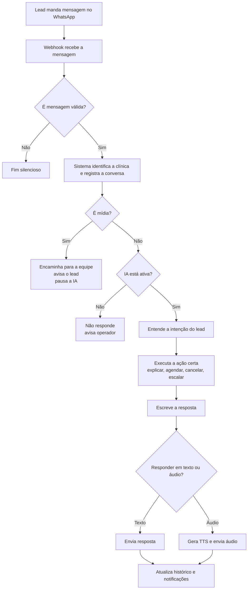

# Jornada da Mensagem

Este documento descreve o fluxo vivo da conversa no código em `2026-06-11`.

O arquivo [conversation-flow.xml](./conversation-flow.xml) continua útil para edição visual no diagrams.net, mas os diagramas abaixo são a referência textual mais atual para leitura rápida e debug.

Arquivos separados para compartilhamento:

- [Desenho simples para negócio](./journey-business.md)
- [Desenho detalhado para operação e engenharia](./journey-technical.md)
- [Arquitetura alvo recomendada](./target-architecture.md)
- [Arquitetura AWS ideal](./aws-target-architecture.md)

---

## Visão simples

Fluxo pensado para alguém de negócio entender sem entrar em micro detalhes.



### Em português direto

- Lead manda mensagem.
- O webhook filtra lixo, identifica a clínica e salva a entrada.
- Se for foto, vídeo ou documento, a equipe é acionada e a IA pausa.
- Se for texto ou áudio transcrito, o sistema entende a intenção.
- Depois decide a ação real: responder dúvida, oferecer horários, confirmar, escalar para humano.
- A resposta é escrita.
- O envio pode ser texto, áudio TTS ou texto com mídias intercaladas.
- No fim, histórico, ids externos e alertas são atualizados.

---

## Visão detalhada

Fluxo atualizado para engenharia, suporte e debug.

```mermaid
flowchart TD
    A[WhatsApp Z-API] --> B[/api/whatsapp/zapi]

    B --> C{Filtro inicial}
    C -- grupo/status/sticker --> X1[200 OK silencioso]
    C -- válido --> D{fromMe?}

    D -- sim --> E{Echo já conhecido?}
    E -- sim --> X2[Ignora]
    E -- não --> F{É QA route?}
    F -- sim --> G[Trata como lead]
    F -- não --> H[Registra clinic_user<br/>pausa IA com takeover TTL]

    D -- não --> G

    G --> I[Resolve clínica e canal]
    I --> J{autoReplyEnabled?}
    J -- não --> K[Registra inbound<br/>só notifica operador]
    J -- sim --> L{messageId já existe?}
    L -- sim --> X3[Ignora duplicata]
    L -- não --> M{Tipo de inbound}

    M -- texto --> N[messageText = texto]
    M -- áudio --> O[Baixa áudio<br/>Whisper transcreve<br/>fallback textual se falhar]
    M -- imagem/vídeo/documento --> P[messageText sintético + mediaUrl]

    N --> Q[ConversationOrchestrator.handle]
    O --> Q
    P --> Q

    Q --> R[Dedup por externalId]
    R --> S[Dedup por conteúdo em 5s]
    S --> T[Carrega clinic + editorial + channel config]
    T --> U[RegisterIncomingMessage<br/>lead + conversa + mensagem]

    U --> V{Mídia visual?}
    V -- sim --> W[Rehost assíncrono em Blob]
    W --> Y[Encaminha mídia para receptionistPhone]
    Y --> Z[Notifica operadores]
    Z --> AA{IA ativa?}
    AA -- não --> X4[Fim sem resposta]
    AA -- sim --> AB[Composer media_received]
    AB --> AC[Marca aiPaused=true<br/>needsAttention=true<br/>takeoverExpiresAt=mediaTakeoverTtlHours ou null]
    AC --> AD[sendReply texto ou TTS]
    AD --> X5[Fim respondido]

    V -- não --> AE{autoReplyEnabled?}
    AE -- não --> X6[Fim com notificação]
    AE -- sim --> AF[Debounce do burst<br/>messageDebounceMs ou 3000ms]
    AF --> AG{Chegou msg mais nova?}
    AG -- sim --> X7[Esta msg não responde]
    AG -- não --> AH{Conversa aiPaused?}
    AH -- sim e TTL vigente --> AI[Não responde<br/>notifica operador]
    AH -- sim e TTL expirado --> AJ[Retoma IA]
    AH -- não --> AK[Segue fluxo]
    AJ --> AK

    AK --> AL[Rate limit por conversa]
    AL --> AM[Carrega histórico]
    AM --> AN[State machine<br/>menu, slots, pipeline, reset boundary]
    AN --> AO{Resolve sem LLM?}
    AO -- sim --> AP[Intenção determinística]
    AO -- não --> AQ[IntentClassifier<br/>gpt-4o-mini]
    AP --> AR[Dispatch por intent]
    AQ --> AR

    AR --> AS[BookingService / CalendarGateway / regras determinísticas]
    AS --> AT[ResponseComposer<br/>texto + parts + mediaIds]
    AT --> AU[Salva mensagem agent antes do envio]
    AU --> AV{Modo de envio}
    AV -- texto --> AW[sendTextMessage]
    AV -- TTS --> AX[sintetiza -> Blob -> send-audio -> delete Blob]
    AV -- texto + mídia --> AY[envio intercalado<br/>gap mínimo 1200ms]
    AW --> AZ[Pós-envio]
    AX --> AZ
    AY --> AZ

    AZ --> BA[Atualiza externalId e deliveryFormat]
    BA --> BB[Push para operadores]
    BB --> BC[Tracking de custo]
    BC --> BD[Atualiza unclear count e lead temperature]
```

---

## Onde mora cada informação

| Assunto | Dono atual |
| --- | --- |
| Entrada WhatsApp, filtros, `fromMe`, transcrição de áudio | `src/app/api/whatsapp/zapi/route.ts` |
| Orquestração da jornada | `src/core/pipeline/ConversationOrchestrator.ts` |
| Estado transitório da conversa | `src/core/conversation/ConversationStateMachine.ts` |
| Config operacional por clínica | tabela `clinics` |
| Playbook, tom, política comercial, mídia editorial | `playbook_versions` via `resolveActiveEditorialConfig()` |
| Tratamentos, duração, pipeline, gatilhos | tabela `treatments` |
| Histórico persistido de mensagens | tabela `messages` |
| Conversa pausada, atenção humana, TTL | tabela `conversations` |
| Classificação da intenção | `src/core/intelligence/IntentClassifier.ts` |
| Escrita da resposta | `src/core/intelligence/ResponseComposer.ts` |
| TTS | `src/infrastructure/adapters/ai/tts/*` |
| Envio WhatsApp | `src/infrastructure/adapters/channels/whatsapp/*` |
| Reserva e confirmação de agenda | `BookingService` + `CalendarGateway` |
| Follow-ups e reengajamento | `src/app/api/cron/follow-up-dispatcher/route.ts` + `scheduleFollowUp()` |

---

## Configurações vivas hoje

| Comportamento | Onde está |
| --- | --- |
| Liga/desliga IA | `clinics.autoReplyEnabled` |
| Jornada `menu_first` ou `concierge` | `clinics.conversationExperience` |
| Itens do menu | `clinics.menuItems` |
| Saudação inicial | `clinics.greetingMessage` |
| TTL do takeover por operador | `clinics.takeoverTtlHours` |
| TTL da pausa após mídia | `clinics.mediaTakeoverTtlHours` |
| Rate limit por conversa | `clinics.rateLimitPerHour` |
| Quantas mensagens confusas antes de escalar | `clinics.unclearThreshold` |
| Gap para conversa ficar stale | `clinics.staleConversationHours` |
| Throttle de mensagem muito rápida | `clinics.rapidThrottleMs` |
| Debounce de burst | `clinics.messageDebounceMs` com fallback atual de `3000ms` |
| Responder em voz | `clinics.voiceResponseEnabled` |
| Provider e velocidade de TTS | `clinics.ttsConfig` |
| Para quem encaminhar mídia do lead | `clinics.receptionistPhone` |
| Duração default do slot | `clinics.defaultAppointmentDurationMinutes` |
| Buffer pós-consulta | `clinics.postAppointmentBufferMinutes` |
| Janela de oferta de slots | `clinics.slotOfferTtlMinutes` |
| Quantos slots oferecer | `clinics.maxSlotsToOffer` |
| Quantos dias olhar na agenda | `clinics.slotLookaheadDays` |

---

## Tempos e gargalos do fluxo atual

Os maiores atrasos hoje vêm do fato de o webhook esperar tudo em sequência:

| Etapa | Natureza |
| --- | --- |
| Download do áudio do Z-API | rede externa |
| Whisper | chamada externa |
| Debounce de burst | atraso proposital |
| IntentClassifier | chamada externa |
| ResponseComposer | chamada externa |
| TTS | chamada externa |
| Upload de blob do TTS | chamada externa |
| Envio Z-API | chamada externa |

Na prática, o caminho mais pesado hoje é:

`áudio do lead -> download -> Whisper -> debounce -> classify -> compose -> TTS -> Blob -> Z-API`

Esse caminho é confiável para pouco volume, mas é frágil para produção mais intensa porque quase tudo acontece dentro da janela do webhook.

---

## Se der problema, comece aqui

| Sintoma | Primeiro lugar para olhar |
| --- | --- |
| Demora para responder tudo | `zapi/route.ts` e `ConversationOrchestrator.ts` |
| Áudio demora demais | download do Z-API + `WhisperGateway` + `sendReply()` |
| TTS fala estranho | `ResponseComposer.ts` modo áudio + `sanitizeForTts()` |
| Resposta duplicada | dedupe no webhook + dedupe do orquestrador + debounce |
| Mensagem sumiu | `messages.externalId`, logs do Z-API e `sendReply()` |
| Lead mandou mídia e a IA “morreu” | `mediaTakeoverTtlHours` e flags `aiPaused` |
| Follow-up disparou errado | `scheduleFollowUp()` + cron dispatcher |
| Operador respondeu e a IA continuou | caminho `fromMe` em `zapi/route.ts` |
| IA não retomou depois de pausa | `conversations.takeoverExpiresAt` |
| Horários ficaram inconsistentes | `ConversationStateMachine` + `BookingService` + `CalendarGateway` |

### Checklist mínimo de debug

1. Ver se a mensagem entrou no webhook.
2. Ver se foi descartada por filtro ou dedupe.
3. Ver se foi salva em `messages`.
4. Ver se a conversa ficou `aiPaused`.
5. Ver quanto tempo cada chamada externa levou.
6. Ver se a resposta foi salva antes do envio.
7. Ver se a Z-API devolveu `messageId`.

Sem essa trilha, o time fica tentando corrigir “no escuro”.
