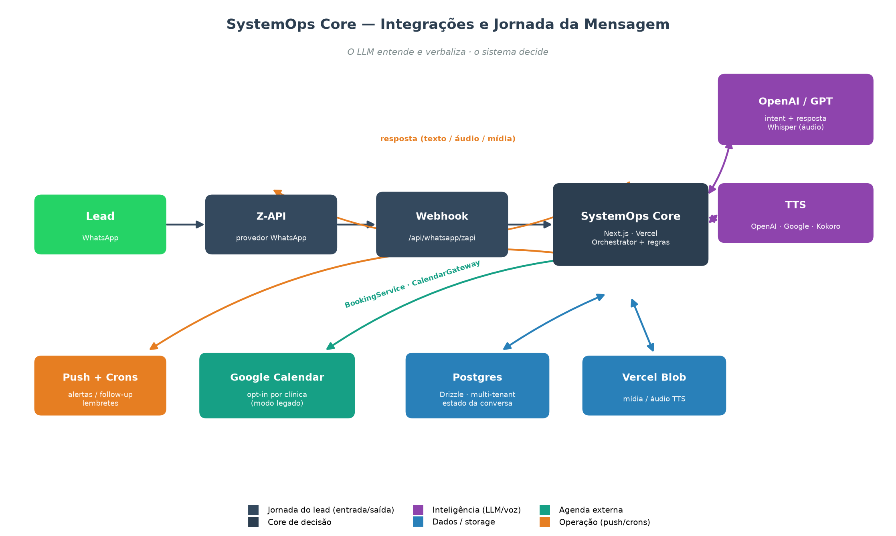
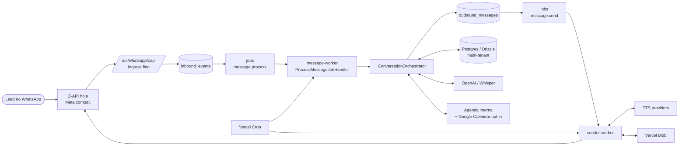
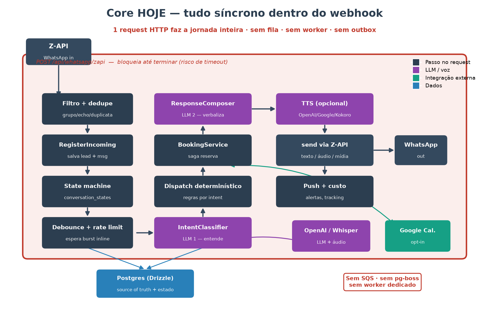
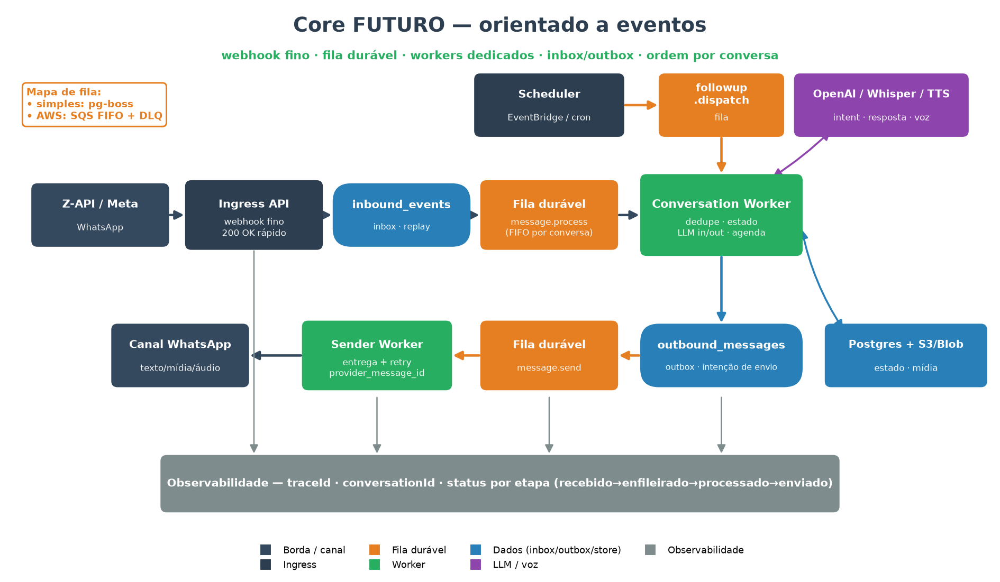
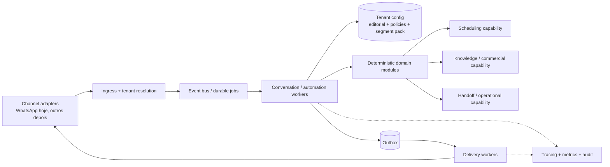

# Diagramas de Arquitetura

Diagramas simples e versionáveis do SystemOps Core. As imagens PNG são geradas
pelos scripts `_gen_*.py` com `matplotlib`. As fontes Mermaid abaixo são a
versão editável e diff-ável de cada desenho.

Regenerar as imagens:

```bash
python3 docs/architecture/diagrams/_gen_system_integrations.py
python3 docs/architecture/diagrams/_gen_core_today.py
python3 docs/architecture/diagrams/_gen_core_event_driven.py
node docs/architecture/diagrams/_gen_systemops_current_drawio.mjs
```

## Arquitetura atual editável no Draw.io

[`systemops-current-architecture.drawio`](./systemops-current-architecture.drawio)
é o desenho multipágina da arquitetura viva do produto. O arquivo possui quatro
abas:

1. arquitetura técnica e integrações internas/externas;
2. microintegrações do runtime conversacional, LLMs e pipeline;
3. features, fontes de verdade e data lineage da Home;
4. campanhas de preço, reativação e automações recorrentes.

O `.drawio` é gerado sem compressão para continuar versionável e pode ser
editado diretamente no diagrams.net. Se o gerador for alterado, regenere o
arquivo com o comando Node acima.

A versão navegável para GitHub Pages vive em
[`docs/solution-site`](../../solution-site/README.md). Ela apresenta as quatro
abas como SVG, além dos princípios arquiteturais, stack, técnicas de engenharia
e features do produto.

## 1. Integrações e tenancy atuais



Visão de alto nível do produto rodando hoje: canal principal via Z-API,
compatibilidade com Meta, inbox de eventos no Postgres, workers lógicos via
cron, agenda interna/Google Calendar, IA e storage.



## 2. Core atual do runtime conversacional



O pipeline principal inbound/outbound já está desacoplado:

- webhook recebe, valida, resolve tenant, persiste e enfileira;
- `message-worker` processa a conversa principal;
- `sender-worker` entrega a outbox sem recomputar a conversa.

Exceção importante: alguns crons auxiliares ainda fazem envio direto
(`appointment-reminder`, `follow-up-dispatcher`, `recovery-campaign`).

```mermaid
flowchart TD
    A[WhatsApp provider] --> B[/api/whatsapp/zapi]
    B --> C[inbound_events]
    C --> D[jobs: message.process]
    D --> E[ProcessMessageJobHandler]
    E --> F[ConversationOrchestrator]
    F --> G[RegisterIncomingMessage]
    F --> H[ConversationStateMachine]
    F --> I[IntentClassifier]
    F --> J[BookingService / CalendarGateway]
    F --> K[ResponseComposer]
    K --> L[outbound_messages]
    L --> M[jobs: message.send]
    M --> N[SendMessageJobHandler]
    N --> O[OutboundDeliveryService / sendVoiceOrText]
    O --> P[WhatsApp provider]
```

## 3. Mapa de evolução para a arquitetura 2.0



Este desenho não descreve o runtime atual; ele explicita o eixo de evolução
recomendado para a 2.0 multi-tenant e multi-segmento.

Ideias centrais:

- manter tenancy, inbox/outbox e retry como base;
- generalizar o domínio exposto (`organization`, `service`, `resource`);
- tratar agenda como capability opcional;
- permitir múltiplos canais sem mudar o miolo de decisão;
- preservar a regra: o LLM entende e verbaliza; o sistema decide.


