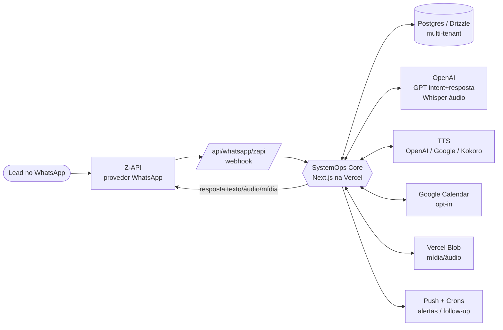
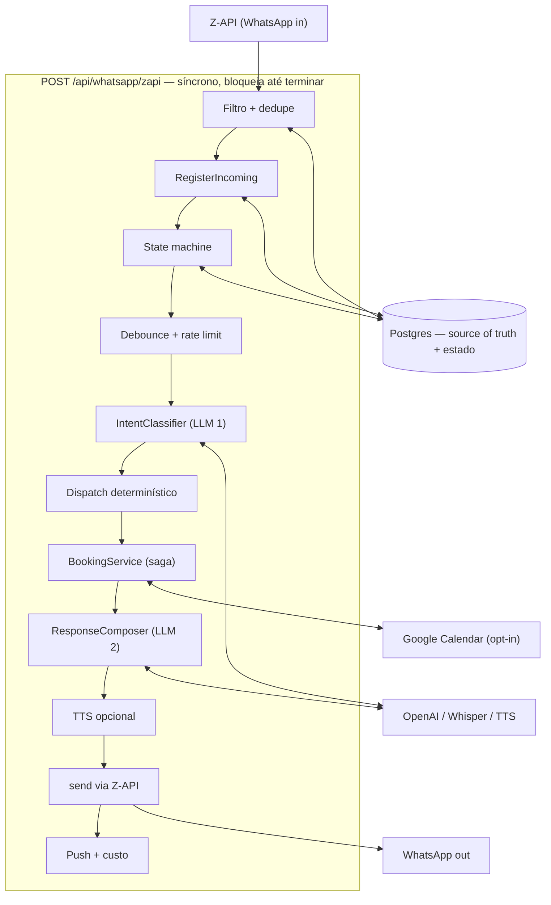
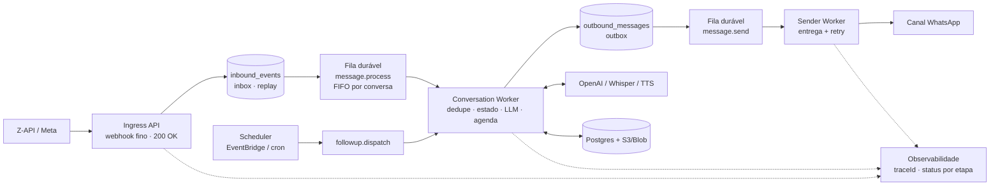

# Diagramas de Arquitetura

Diagramas simples e versionáveis do SystemOps Core. As imagens PNG são geradas
pelos scripts `_gen_*.py` (matplotlib). As fontes Mermaid abaixo são a versão
editável/diff-ável de cada desenho.

Regenerar as imagens:

```bash
python3 docs/architecture/diagrams/_gen_system_integrations.py
python3 docs/architecture/diagrams/_gen_core_today.py
python3 docs/architecture/diagrams/_gen_core_event_driven.py
```

---

## 1. Integrações e jornada da mensagem


Visão de alto nível: por onde o lead entra, o core de decisão e as integrações
reais (OpenAI/GPT, TTS, Postgres, Vercel Blob, Google Calendar, Push/Crons).



---

## 2. Core HOJE (síncrono)


A jornada inteira roda dentro de **uma request HTTP** em
`POST /api/whatsapp/zapi`: filtro/dedupe → registro → state machine →
debounce/rate limit → `IntentClassifier` (LLM) → dispatch determinístico →
`BookingService` → `ResponseComposer` (LLM) → TTS opcional → envio via Z-API →
push + tracking. **Não há fila, worker dedicado nem outbox.** O Postgres é a
fonte de verdade e o estado da conversa.

Consequências: webhook pesado, risco de timeout, várias chamadas externas em
sequência e retry/idempotência limitados.



---

## 3. Core FUTURO (orientado a eventos)


Alinhado a [`../target-architecture.md`](../target-architecture.md) e
[`../aws-target-architecture.md`](../aws-target-architecture.md):

- **Ingress fino**: recebe, valida, persiste em `inbound_events` (inbox) e
  responde `200` rápido.
- **Fila durável** (`message.process`) desacopla entrada de processamento, com
  retry, backoff, DLQ e ordem por conversa.
- **Conversation Worker** roda a jornada (dedupe, estado, LLM in/out, agenda) e
  grava a intenção em `outbound_messages` (outbox).
- **Fila `message.send` + Sender Worker** entregam no canal sem recomputar a
  conversa.
- **Scheduler** (EventBridge/cron) → `followup.dispatch` reaproveita o
  Conversation Worker.
- **Observabilidade** com `traceId`/`conversationId` rastreia cada etapa.

Mapa de fila: simples = `pg-boss` no mesmo Postgres; AWS = `SQS FIFO + DLQ`.


