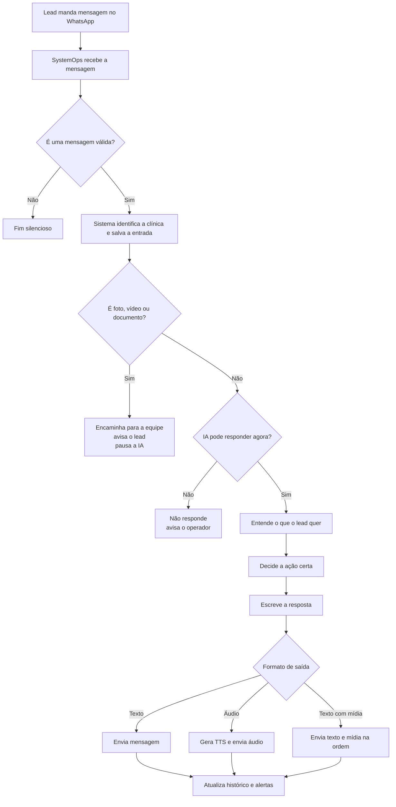

# Jornada do Lead

Versão enxuta para conversa com operação, clínica e negócio.

## Leitura rápida

- O lead entra pelo WhatsApp.
- O sistema valida a mensagem e identifica de qual clínica ela é.
- Se for mídia visual, a equipe humana assume.
- Se for uma conversa normal, a IA entende a intenção e executa a ação correta.
- Depois a resposta sai em texto, áudio ou texto com mídia.
- No fim, o histórico e os alertas internos são atualizados.

## Decisões de negócio mais importantes

- A clínica pode desligar a IA.
- A clínica pode escolher se responde em texto ou voz.
- A clínica pode definir quando a IA pausa e quando retoma.
- A clínica pode decidir para quem enviar mídia recebida do lead.
