# Jornada Técnica da Mensagem

Versão detalhada para engenharia, suporte e debug operacional.

```mermaid
flowchart TD
    A["WhatsApp Z-API"] --> B["/api/whatsapp/zapi"]

    B --> C{"Filtro inicial"}
    C -->|grupo/status/sticker| X1["200 OK silencioso"]
    C -->|válido| D{"fromMe?"}

    D -->|sim| E{"Echo já conhecido?"}
    E -->|sim| X2["Ignora"]
    E -->|não| F{"É QA route?"}
    F -->|sim| G["Segue como lead"]
    F -->|não| H["Registra clinic_user<br/>pausa IA com takeover TTL"]

    D -->|não| G

    G --> I["Resolve clínica lógica e clínica do canal"]
    I --> J{"autoReplyEnabled?"}
    J -->|não| K["Registra entrada<br/>só notifica"]
    J -->|sim| L{"messageId já existe?"}
    L -->|sim| X3["Ignora duplicata"]
    L -->|não| M{"Tipo de inbound"}

    M -->|texto| N["Usa texto recebido"]
    M -->|áudio| O["Download do áudio<br/>Whisper<br/>fallback textual"]
    M -->|imagem/vídeo/documento| P["Cria texto sintético + mediaUrl"]

    N --> Q["ConversationOrchestrator.handle"]
    O --> Q
    P --> Q

    Q --> R["Dedup por externalId"]
    R --> S["Dedup por conteúdo em 5s"]
    S --> T["Carrega clinic + editorial + channel config"]
    T --> U["RegisterIncomingMessage"]

    U --> V{"Mídia visual inbound?"}
    V -->|sim| W["Rehost assíncrono em Blob"]
    W --> Y["Encaminha mídia para receptionistPhone"]
    Y --> Z["Push para operadores"]
    Z --> AA{"IA ativa?"}
    AA -->|não| X4["Fim sem resposta"]
    AA -->|sim| AB["Composer media_received"]
    AB --> AC["Marca aiPaused + needsAttention + TTL de mídia"]
    AC --> AD["sendReply texto ou TTS"]
    AD --> X5["Fim respondido"]

    V -->|não| AE{"replyEnabled?"}
    AE -->|não| X6["Fim com notificação"]
    AE -->|sim| AF["Debounce do burst"]
    AF --> AG{"Existe mensagem mais nova?"}
    AG -->|sim| X7["Esta msg não responde"]
    AG -->|não| AH{"Conversa pausada?"}
    AH -->|sim e TTL vigente| AI["Silêncio + notificação"]
    AH -->|sim e TTL expirado| AJ["Retoma IA"]
    AH -->|não| AK["Segue"]
    AJ --> AK

    AK --> AL["Rate limit por conversa"]
    AL --> AM["Carrega histórico"]
    AM --> AN["State machine"]
    AN --> AO{"Resolve sem LLM?"}
    AO -->|sim| AP["Intenção determinística"]
    AO -->|não| AQ["IntentClassifier"]
    AP --> AR["Dispatch por intent"]
    AQ --> AR

    AR --> AS["BookingService / CalendarGateway / regras"]
    AS --> AT["ResponseComposer"]
    AT --> AU["Salva agent message antes do envio"]
    AU --> AV{"Modo de envio"}
    AV -->|texto| AW["sendTextMessage"]
    AV -->|TTS| AX["TTS -> Blob -> send-audio -> cleanup"]
    AV -->|intercalado| AY["Texto e mídia com gap mínimo"]
    AW --> AZ["Pós-envio"]
    AX --> AZ
    AY --> AZ

    AZ --> BA["Atualiza externalId e deliveryFormat"]
    BA --> BB["Push"]
    BB --> BC["Tracking de custo"]
    BC --> BD["Atualiza unclear count e temperatura do lead"]
```

## Onde investigar por área

- Entrada e filtros: `src/app/api/whatsapp/zapi/route.ts`
- Orquestração principal: `src/core/pipeline/ConversationOrchestrator.ts`
- Classificação: `src/core/intelligence/IntentClassifier.ts`
- Escrita da resposta: `src/core/intelligence/ResponseComposer.ts`
- TTS: `src/infrastructure/adapters/ai/tts/*`
- Envio WhatsApp: `src/infrastructure/adapters/channels/whatsapp/*`
- Estado transitório: `src/core/conversation/ConversationStateMachine.ts`
- Agenda: `BookingService` e `CalendarGateway`

## Gargalos do desenho atual

- Muito trabalho síncrono dentro do webhook.
- Muitas chamadas externas em sequência.
- Entrada, processamento e envio ainda estão muito acoplados.
- Sem trilha operacional única para seguir uma mensagem ponta a ponta.
