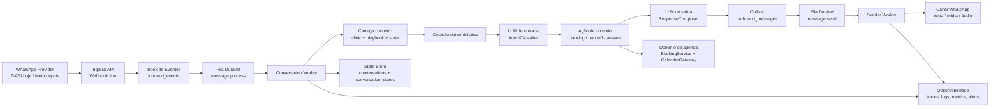
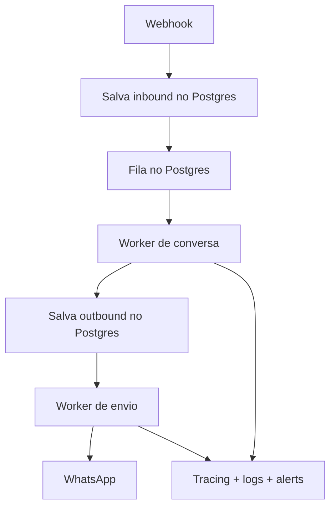
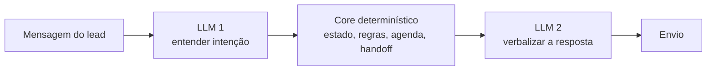

# Arquitetura Alvo

Este documento propõe a arquitetura alvo para o SystemOps Core olhando a jornada técnica atual, os gargalos de latência, os riscos de duplicação e a necessidade de debug operacional.

## Resposta curta

Não, o sistema não precisa de mais peças de domínio.

Ele precisa de fronteiras melhores entre as peças que já existem.

A forma mais simples e saudável de evoluir é:

1. manter o domínio no mesmo repositório;
2. tirar o trabalho pesado de dentro do webhook;
3. colocar fila durável entre entrada, processamento e envio;
4. criar workers dedicados;
5. instrumentar tudo com tracing e ids de correlação.

## Recomendação objetiva

### Caminho recomendado agora

Mesmo repositório, dois runtimes lógicos:

- `web`: Next.js, UI, APIs finas, webhooks, inbox, settings, owner
- `worker`: processamento assíncrono da conversa, TTS, follow-ups, envio

Mesmo banco, mesma modelagem principal, mesma base de domínio.

### Quando separar em outro serviço ou outro repositório

Só faz sentido separar quando existir ao menos uma destas condições:

- volume alto o bastante para exigir deploy independente do worker;
- necessidade real de times separados;
- necessidade de stack diferente para worker;
- filas e consumidores crescerem a ponto de o app web virar gargalo de deploy;
- exigência operacional clara de isolamento entre atendimento e painel web.

Antes disso, separar repo tende a aumentar complexidade mais do que reduzir.

---

## Desenho Alvo Recomendado

## Leitura do desenho

- O webhook só recebe, valida, identifica a clínica, salva e enfileira.
- O worker de conversa processa a lógica da jornada.
- O worker de envio cuida só de entregar no WhatsApp.
- Tudo relevante fica persistido antes de seguir para a próxima etapa.
- Cada etapa tem retry, idempotência e rastreabilidade.

---

## Versão Mais Simples Possível

Se a meta for simplificar sem “microservicizar”, esta é a melhor forma:

### O que essa versão resolve

- webhook rápido;
- menos timeout;
- retry real;
- menor risco de responder duas vezes;
- melhor debug;
- sem Redis obrigatório;
- sem outro repositório obrigatório.

### O que ela não tenta resolver ainda

- orchestration visual complexa;
- fanout distribuído entre muitos serviços;
- múltiplas filas especializadas por dezenas de tipos de job.

Para o estágio atual, isso é uma virtude, não uma limitação.

---

## Responsabilidades Ideais

### 1. Ingress API

Responsabilidade:

- autenticar origem;
- normalizar payload;
- gerar `traceId`, `messageId`, `conversationKey`;
- persistir o evento inbound;
- publicar job;
- responder rápido com `200`.

Nunca deveria:

- chamar LLM;
- esperar TTS;
- fazer envio de resposta;
- decidir jornada completa.

### 2. Inbox de Eventos

Responsabilidade:

- servir como trilha bruta do que entrou;
- permitir replay;
- permitir auditoria;
- separar “recebi” de “processei”.

Tabela sugerida:

- `inbound_events`

Campos-chave:

- `id`
- `provider`
- `provider_message_id`
- `clinic_id`
- `conversation_key`
- `payload`
- `received_at`
- `dedupe_key`
- `processing_status`

### 3. Fila Durável

Responsabilidade:

- desacoplar entrada, processamento e envio;
- suportar retry, backoff e dead letter;
- permitir concorrência controlada;
- serializar por conversa.

Filas mínimas:

- `message.process`
- `message.send`
- `media.rehost`
- `followup.dispatch`

### 4. Conversation Worker

Responsabilidade:

- ler evento inbound;
- aplicar idempotência;
- carregar estado;
- rodar classificação;
- executar regra determinística;
- produzir mensagem outbound;
- atualizar estado da conversa.

Nunca deveria:

- depender do request do webhook;
- enviar diretamente ao canal sem passar por outbox.

### 5. Outbox

Responsabilidade:

- garantir que o sistema saiba exatamente o que pretende enviar;
- permitir retry de envio sem recomputar toda a conversa;
- permitir auditoria de “o que seria enviado” versus “o que foi enviado”.

Tabela sugerida:

- `outbound_messages`

Campos-chave:

- `id`
- `conversation_id`
- `clinic_id`
- `payload`
- `delivery_mode`
- `status`
- `provider_message_id`
- `retry_count`

### 6. Sender Worker

Responsabilidade:

- enviar texto, mídia e áudio;
- tratar retry de canal;
- atualizar `provider_message_id`;
- marcar entrega técnica;
- nunca recomputar a conversa.

### 7. Observabilidade

Responsabilidade:

- rastrear a mensagem ponta a ponta;
- mostrar tempo por etapa;
- alertar falhas por fila, por clínica e por provider;
- permitir responder “onde travou?” em minutos.

Campos que devem estar em todo log e span:

- `traceId`
- `providerMessageId`
- `conversationId`
- `conversationKey`
- `clinicId`
- `leadId`
- `jobId`

---

## Patterns que fazem mais sentido aqui

### Inbox Pattern

Primeiro persistir o que chegou. Depois processar.

Isso reduz perda de evento e permite replay.

### Outbox Pattern

Primeiro persistir a intenção de envio. Depois entregar.

Isso reduz “eu mandei ou não mandei?”.

### Idempotency Keys

Toda etapa deve aceitar reexecução sem efeito colateral duplo.

Exemplos:

- inbound: `provider + provider_message_id`
- send: `outbound_message_id`
- booking: `conversation_id + offered_slot_id`

### Saga para booking

O booking já caminha nessa direção e deve continuar assim:

- reservar
- validar conflito
- confirmar no calendário
- persistir appointment
- compensar se falhar

### Single Writer por conversa

O ideal é processar uma conversa por vez.

Na prática:

- particionar a fila por `conversationKey`, ou
- usar lock curto por conversa no worker.

Isso reduz:

- respostas fora de ordem;
- corrida entre bursts;
- duplicação de respostas;
- estado inconsistente.

### Retry com backoff e Dead Letter

Nem todo erro deve ter o mesmo retry.

Exemplo:

- erro do provider WhatsApp: retry curto;
- timeout de TTS: retry limitado;
- erro de payload inválido: DLQ direto;
- erro de regra de negócio: não retryar infinitamente.

---

## Como deveria ficar o uso do LLM

O melhor padrão aqui continua sendo o “sanduíche”, mas com processamento assíncrono no meio.

Isso é o caminho ideal.

O que não é ideal:

- LLM dentro do webhook bloqueando tudo;
- LLM decidindo regra operacional;
- TTS misturado ao mesmo fluxo síncrono do inbound;
- envio acontecendo sem outbox;
- dedupe espalhado sem trilha única.

---

## Arquitetura moderna: o que eu adotaria

### Base

- monorepo ou repo único
- Next.js para app e APIs
- Postgres como source of truth
- fila durável
- workers dedicados
- tracing distribuído
- alertas operacionais

### Stack recomendada por estágio

#### Estágio 1 — mais simples e forte

- Postgres + `pg-boss`
- worker no mesmo repo
- Sentry + OpenTelemetry

Indicado quando:

- vocês querem o menor salto operacional;
- já usam Postgres e querem evitar Redis agora;
- precisam resolver logo latência e duplicação.

#### Estágio 2 — mais gerenciado

- Inngest ou Trigger.dev
- mesma separação de responsabilidades
- menos infra própria de fila

Indicado quando:

- vocês querem durable workflows com menos código de infraestrutura;
- valorizam dashboard de jobs, retries e runs como produto pronto;
- aceitam depender mais de plataforma externa.

#### Estágio 3 — mais plataforma

- app web separado de worker service
- fila dedicada
- observabilidade central
- adapters de canal isolados

Indicado quando:

- o volume crescer;
- houver mais canais além de WhatsApp;
- o worker precisar escalar independente do web app.

---

## Minha recomendação final para o SystemOps

### O que eu faria

1. manteria um repositório só;
2. criaria `inbound_events` e `outbound_messages`;
3. colocaria uma fila durável;
4. moveria o processamento da jornada para worker;
5. moveria o envio para worker separado;
6. adicionaria tracing e dashboard operacional;
7. só depois avaliaria separar deploys ou serviços.

### O que eu não faria agora

- reescrever tudo;
- criar microserviços demais;
- abrir outro repositório cedo demais;
- introduzir Redis, Kafka ou NATS sem necessidade real;
- manter o webhook como “super endpoint” que faz tudo.

### Frase-resumo

A arquitetura ideal para este sistema não é “mais distribuída por vaidade”.

Ela é “mais simples por responsabilidade”:

- entrada recebe;
- fila desacopla;
- worker decide;
- sender entrega;
- observabilidade explica.
