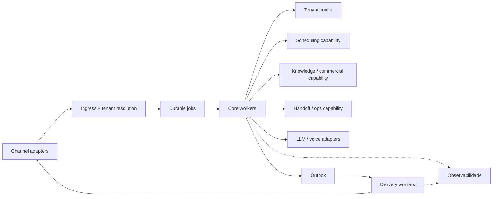

# Arquitetura Alvo 2.0

Este documento descreve a direção recomendada para a arquitetura 2.0 do
SystemOps: multi-tenant, multi-segmento e orientada a capabilities, sem perder
os acertos do runtime atual.

## Resposta curta

A 2.0 não deve recomeçar de tenancy.

Ela deve:

1. preservar o isolamento por tenant já existente;
2. generalizar o domínio exposto;
3. tratar agenda como capability opcional;
4. manter inbox/outbox, retry e workers como base operacional;
5. continuar com a regra: **o LLM entende e verbaliza; o sistema decide**.

## O que a 2.0 herda do sistema atual

Essas decisões já estão corretas e devem ser preservadas:

- tenant resolvido antes de qualquer ação relevante;
- configuração por tenant no banco;
- pipeline com `inbound_events`, `jobs` e `outbound_messages`;
- workers lógicos para processamento e entrega;
- separação entre classificação, decisão e verbalização.

## O que precisa mudar

### 1. Domínio exposto

O produto ainda fala com nomes muito clinic-centric:

- `Clinic`
- `Treatment`
- `Professional`
- `Appointment`

Na 2.0, a API de produto deve caminhar para abstrações mais neutras, como:

- `Organization` ou `Workspace`
- `Service` ou `Offering`
- `Resource`
- `Booking` ou `Case`

### 2. Capabilities opcionais

Agendamento não deve ser pressuposto universal.

A 2.0 deve modularizar pelo menos:

- scheduling;
- handoff/ops;
- commercial/knowledge;
- voice;
- reminders/follow-ups.

### 3. Packs por segmento

O tenant precisa continuar configurável, mas a 2.0 deve permitir packs de
segmento para reduzir setup manual:

- prompts base;
- terminologia (`serviceNoun`);
- regras de urgência;
- capacidades habilitadas por padrão;
- UX de onboarding.

## Desenho recomendado

## Regras de modelagem

### Tenant

Tudo que varia por cliente continua em:

- `clinics` ou sucessor equivalente;
- `clinic_modules`;
- `playbook_versions`;
- catálogo de serviços.

### Capability

Cada capability deve ter:

- config própria;
- portas de aplicação claras;
- testes determinísticos;
- possibilidade de ser desligada sem quebrar o core.

### Canal

Canal é adapter. WhatsApp continua sendo o principal hoje, mas não deve
contaminar o domínio com regras específicas além do necessário.

## Limite importante

Não transformar a 2.0 em um conjunto difuso de agentes sem fronteira.

O ganho do sistema atual está justamente em:

- decisão determinística;
- trilha auditável;
- retry previsível;
- ownership claro dos dados.

Se a 2.0 perder isso, vira regressão de plataforma.
