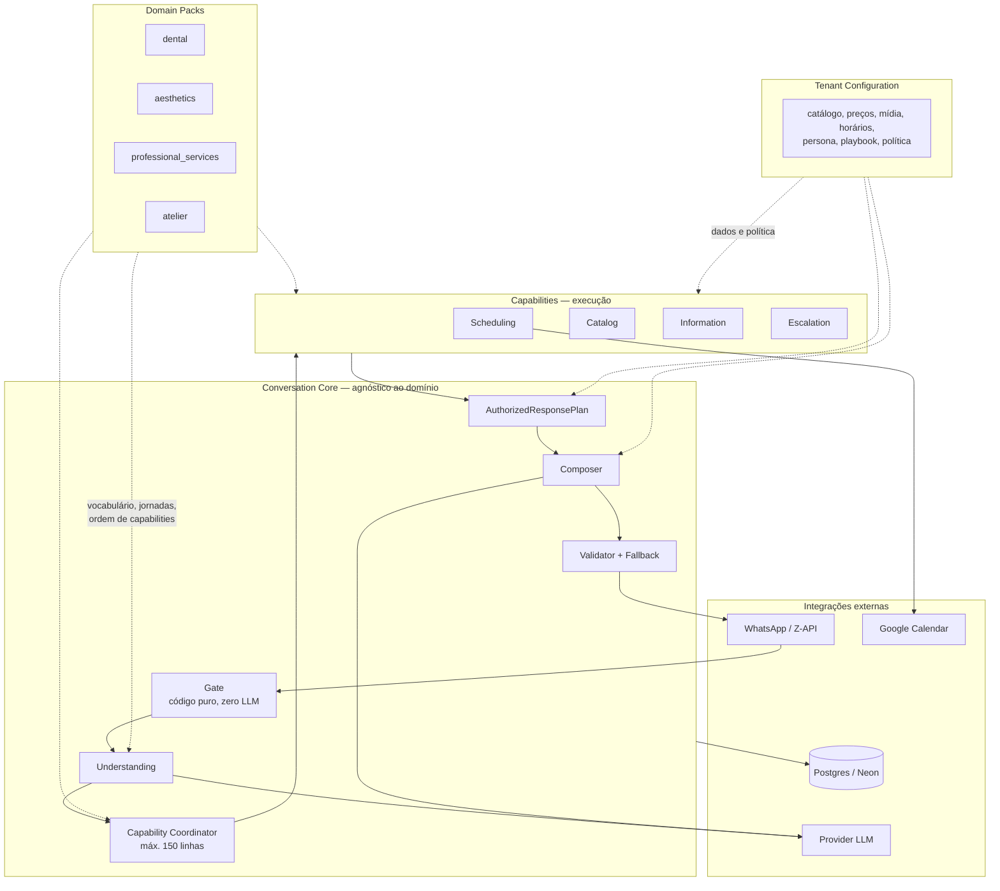
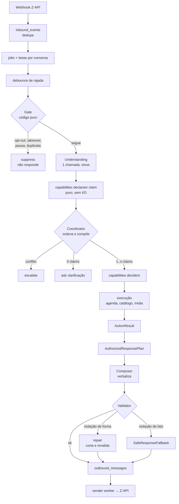
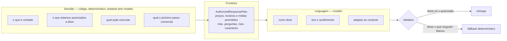
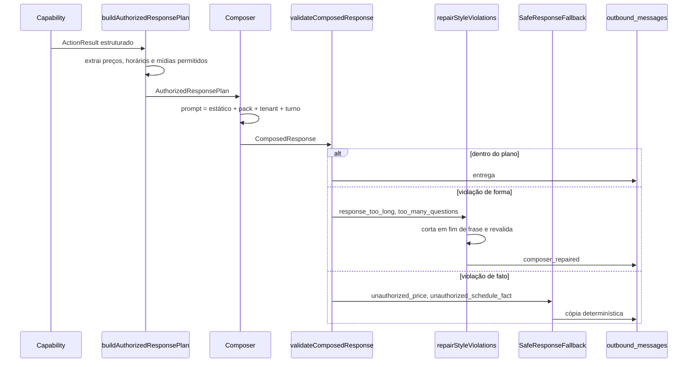
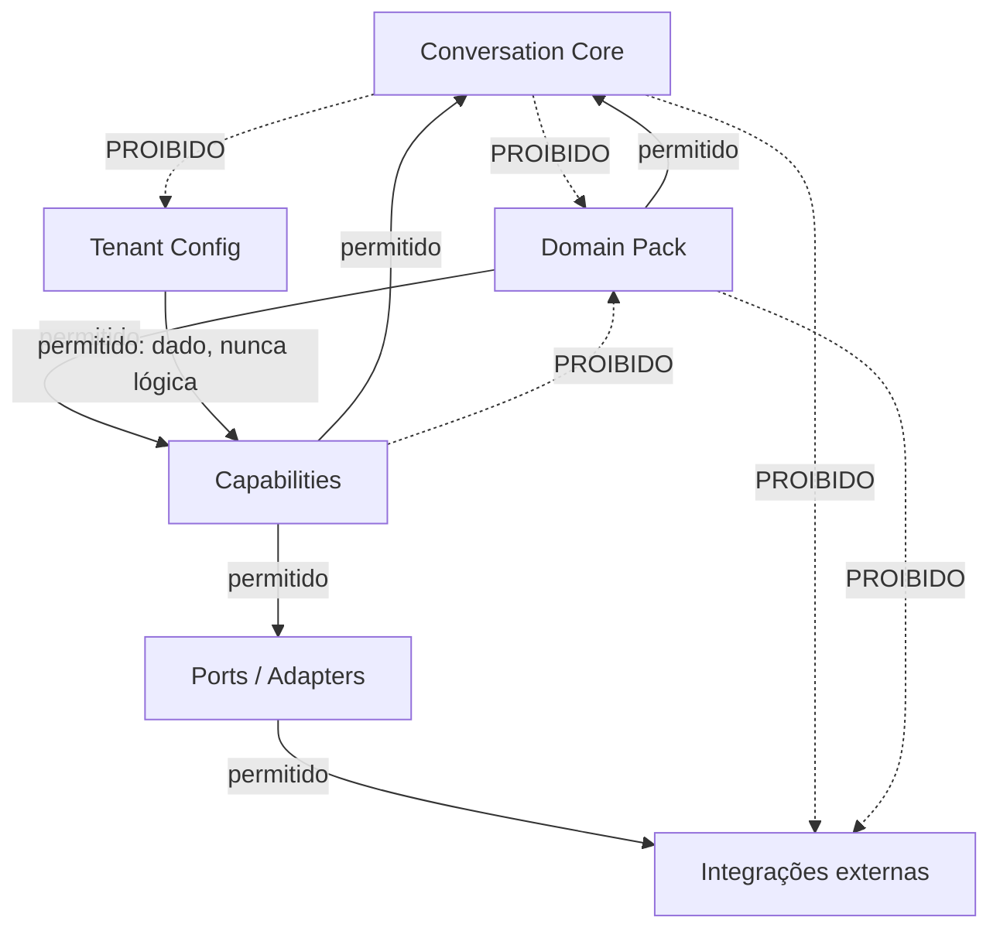
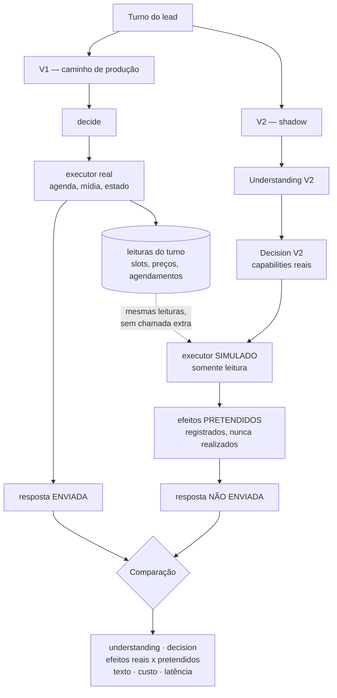

# Conversation Intelligence V2 — clean room da inteligência sobre contratos preservados

Data: 2026-08-15
Status: aprovado na direção arquitetural; plano de implementação ainda não escrito
Posição no programa: spec de reset. Sucede [`docs/ai-system/audit.md`](../../ai-system/audit.md), que é o diagnóstico medido; antecede o plano de execução.

Baseline no momento desta spec: `npm run verify` verde — 278 arquivos, 2.551 testes.
Base de comparação: `d6730d5` (reparo de estilo do Ciclo 1, já commitado).

---

## 1. Decisão

Reconstruir do zero a camada que **interpreta linguagem e decide comportamento**, preservando
os contratos determinísticos, as features e a infraestrutura que já se provaram corretos.

O que é reconstruído sem herança: Conversation Understanding, classificação/intents, a camada de
decisão, heurísticas de decisão, keywords, regex sobre linguagem aberta, coercions e overrides,
prompts, estratégia conversacional, estratégia de vendas, o composer e suas instruções, regras de
domínio e segmento, construção de contexto para o LLM, e os agents/commands/skills que descrevem
essa camada.

O que é preservado e pode evoluir com evidência: `AuthorizedResponsePlan`, `ResponseValidator`,
`SafeResponseFallback`, `ActionResult` e os contratos estruturados, state machine persistida,
inbox/outbox, lease e controle de concorrência, replay, tracing, multi-tenancy, banco, CRM,
agenda, mídia, WhatsApp, workers e integrações externas.

A V1 permanece disponível **somente** para comparação, regressão e rollback. Não é fonte de
requisitos.

## 2. Por que reset e não refatoração

A auditoria mediu o mecanismo que produz a dívida. `handle()` tem 4.571 linhas em um escopo
único, com 529 `if` e 296 regex literais. Ao lado dele existem 30 predicados de palavra-chave e
uma função — `coerceBusinessIntent` — cuja finalidade declarada é sobrescrever um classificador.
A baseline persistida mede 73,0% nos 21 incidentes reais e 92,5% nas 58 frases derivadas do
próprio prompt; o antigo número de 95,2% não possui baseline persistida e foi retirado do gate.

Refatorar extraindo helpers reduz o tamanho do *arquivo* e não toca o problema, que é o
*escopo*. Enquanto toda decisão conversacional couber no mesmo lugar, cada bug novo continua
entrando como mais um `if` ali — que é exatamente como os 30 predicados nasceram.

Quatro achados verificados no código em 15/08 definem o desenho. Não são preferência de estilo;
cada um é uma restrição:

| Achado | Evidência | Restrição que impõe |
| --- | --- | --- |
| Intents carregam movimento de diálogo | `normalizeSchedulingIntentForMissingPendingOffer` (ConversationOrchestrator.ts:1596), `resolvePendingSlotChoice` (:1382) | `confirm_slot` e `reject_slots` só significam algo diante de uma oferta pendente. A V1 classifica e **depois corrige o intent**. Movimento de diálogo tem de ser eixo próprio, resolvido contra o estado. |
| O core ramifica por domínio | `isClinicSegment` nasce de regex em PromptContextBuilder.ts:31 e entra em IntentClassifier.ts:71 (prompt) **e** em `coerceBusinessIntent` (:1707) | Regra clínica é conhecimento de domínio. O core não pode ter `if` por segmento. |
| Estratégia de venda mora no prompt | ResponseComposer.ts:630-635, repetida em :801, :811, :821 | O arco ACOLHER→RESPONDER→PROVAR é esperança, não decisão. Explica o bug conhecido de a IA ignorar objeção cadastrada e pivotar para avaliação. |
| Objeção é regex | `objection-triage.ts` — 7 detectores sobre linguagem aberta | Objeção é sinal de entendimento, não match de string. |

## 3. Os quatro invariantes de projeto

Estes invariantes valem sobre todo o resto desta spec. Onde qualquer seção conflitar com eles,
o invariante ganha.

### I1 — A representação do entendimento é hipótese versionada, não taxonomia

Os eixos propostos na seção 4 são a **hipótese inicial**. O corpus e os evals devem poder
demonstrar necessidade de alterar, adicionar ou remover dimensões. Trocar 17 intents por uma
enumeração nova e crescente seria repetir a falha com outro nome.

Operacionalização, para que o invariante não seja só intenção:

- O schema de entendimento carrega versão (`understanding.v1`) e a versão vai no trace.
- Distinção que torna isso administrável: **os eixos são do core; os valores são do domain
  pack**. Acrescentar um valor de `request` no pack dental é rotina e não versiona nada.
  Acrescentar, remover ou redefinir um *eixo* é migração de schema e exige evidência.
- A cada expansão do corpus, revisão de dimensão com três medidas por eixo: **discriminação**
  (o eixo chega a mudar alguma decisão?), **concordância** (revisores e modelo convergem?) e
  **cobertura** (com que frequência fica nulo?). Eixo que nunca muda decisão sai. Anotação
  recorrente de "não consigo expressar isto" no review é candidata a eixo novo.
- Nenhum eixo entra por parecer útil. Entra por caso do corpus que não é representável sem ele.

### I2 — Existe coordenação mínima, e ela é proibida de crescer

Turnos multi-capability são reais — "quanto custa e tem amanhã?" é um turno só com duas
demandas. Existe um `CapabilityCoordinator` para selecionar, compor, resolver dependências e
conflitos, e aplicar ritmo de diálogo mecanicamente. Ele **não** concentra regra de negócio e não
pode virar o novo orquestrador. A distribuição completa de responsabilidades — e a razão de não
existir um `DecisionCore` — está na seção 6.1.

Restrições estruturais, verificadas por teste arquitetural:

- Entrada exclusiva: `Understanding`, `ConversationState` e o conjunto de `CapabilityClaim`.
- Proibido importar domain pack, configuração de tenant ou qualquer porta de integração.
- Cada capability expõe `claim(understanding, state) → Claim | null`, pura, barata, sem I/O; e
  `decide(claim, context) → Decision`, que pode ler pelas portas.
- Ordem e dependência entre capabilities são **declaradas pelo domain pack**, não decididas
  pelo coordinator.
- Conflito entre decisões não é resolvido por heurística: escala. Adivinhar aqui é como a V1
  ganhou overrides.
- Orçamento de tamanho explícito, coberto por teste: o **módulo** do coordinator não passa de
  150 linhas. Este número não é derivado de medição — é uma trava deliberada, escolhida para
  ser pequena o bastante a ponto de a primeira regra de negócio que alguém tentar colocar ali
  não caber. Se o orçamento apertar em uso legítimo, a resposta correta é mover
  responsabilidade para uma capability, não aumentar o número. Alterá-lo exige justificativa
  registrada nesta spec.

### I3 — Shadow testa Understanding e Decision de verdade

Reutilizar o `ActionResult` já decidido pela V1 compararia principalmente composição, e
composição não é o objeto do reset. A V2 em shadow decide sozinha e executa contra um
**executor simulado sem efeitos colaterais**, que compartilha as leituras já feitas no turno e
registra quais capabilities e ações a V2 teria executado. Detalhado na seção 11.

### I4 — Golden corpus antes da implementação ampla

Aproximadamente 60 casos revisados entram **antes** da V2 ampla, como força de design e
baseline — não como validação a posteriori. As 8.355 mensagens humanas são candidatas, nunca
verdade automática. As conversas curadas que originaram o `PADRÃO DEMO DE QUALIDADE` viram
golden cases **antes** de o prompt v4 ser descartado; caso contrário perde-se o alvo de
qualidade junto com o texto que o codificava.

## 4. Conversation Understanding

Uma chamada, saída estruturada, eixos independentes. A hipótese inicial (ver I1):

```
Understanding {
  request        // o que o lead pede — vocabulário do DOMAIN PACK
  dialogueMove   // new_topic | answers_pending | acknowledges | repeats | closes
  entities       // date, period, time, service, serviceCandidates[], quantity, ordinal
  signals        // purchaseIntent, priceSensitivity, sentiment, objection
  safety         // optOut, requestsHuman, emergency (só se o pack declarar)
  confidence
  ambiguity      // null | { kind, candidates[] }
}
```

O ganho não é ter mais campos. É que os eixos **não competem entre si**, e por isso não
precisam das regras de desambiguação que o prompt atual carrega.

Confronto contra bugs reais do histórico — argumento de projeto, **não resultado medido**. O que
foi verificado no código é a *causa* de cada bug; que os eixos os eliminam é a hipótese que o
ciclo F precisa provar, com cada um destes casos entrando no corpus antes:

- *"Segunda"* lido como indisponibilidade falsa deixa de ser representável: não há disputa
  entre `confirm_slot` e `reject_slots`; há `dialogueMove: answers_pending` com
  `entities.date`, e o core compara a data com os slots ofertados.
- *"como funciona"* + *"bom dia"* produzindo horário falso deixa de existir: não há
  `isBusinessHoursQuestion` casando substring dentro de "funcionando".
- Ambiguidade de preço entre variações do mesmo procedimento vira `ambiguity.candidates` — que
  é um campo que a V1 já tem e usa bem, e que sobrevive por mérito, não por herança.

**Nenhuma taxonomia da V1 é copiada.** Os 17 intents não são ponto de partida; o vocabulário de
`request` de cada pack é derivado do corpus rotulado.

## 5. Camadas e fronteiras



O core conhece turno, conversa, estado, os eixos, as decisões, o plano, a validação e a
arbitragem. **Não conhece** paciente, consulta, dentista, tratamento, avaliação, urgência
clínica nem convênio — nenhum substantivo de negócio.

## 6. O turno completo



O `Gate` merece destaque: hoje essa lógica está espalhada dentro de `handle()`. Na V2 é a única
origem de `suppress`, roda antes de qualquer chamada de modelo, e é inteiramente determinística.

### 6.1 Quem decide o quê — e por que não existe `DecisionCore`

Versões anteriores desta spec citavam um `DecisionCore` sem nunca defini-lo. Ele era resíduo da
análise de opções, e é precisamente o formato que o próximo `handle()` teria: um componente
horizontal que começa calculando "o próximo passo" e termina contendo pricing, scheduling,
objeção e catálogo.

**O conceito está removido.** Ao distribuir suas responsabilidades, não sobra nenhuma:

| Responsabilidade | Dono | Por quê |
| --- | --- | --- |
| Interpretar linguagem | `Understanding` (estágio do core) | única etapa que chama modelo para entender |
| Selecionar capabilities | `CapabilityCoordinator` | escolhe por `claim`, na ordem que o pack declarou |
| Conter regra de negócio | **Capability**, sempre | é o único lugar vertical; qualquer outro acumula |
| Decidir a ação | a capability que ganhou o claim | quem conhece a regra decide |
| Resolver turno multi-capability | Coordinator | compõe ou escala; nunca arbitra por regra de negócio |
| Calcular `nextBestStep` | a capability que decide | ver abaixo |
| Consultar política comercial | Capability | política é dado de tenant; o core não lê tenant |
| Produzir `Decision` | Capability, em `decide()` | |
| Converter `Decision` → `ActionResult` | Capability, em `execute()` | é o ponto que o shadow substitui |
| Ritmo de diálogo (não repetir CTA pendente) | Coordinator, mecanicamente | é regra de conversa, não de negócio — agnóstica a domínio |

**`nextBestStep` não é um cálculo central.** É um campo do `Decision` produzido pela capability
que decidiu, porque só ela conhece o próximo passo dentro do seu escopo — o pack declarou a
jornada, e a capability a percorre. Centralizar esse cálculo seria reconstruir o acúmulo: as
regras de preço, agenda e objeção convergiriam para um lugar só.

Quando duas capabilities propõem passos diferentes no mesmo turno, o Coordinator resolve
**estruturalmente**, pela prioridade que o pack declarou, ou escala. Nunca por heurística.

O ritmo — não repetir um convite que o lead ainda não respondeu — hoje vive como texto no prompt
(`REGRA DE RITMO — CTA JÁ FEITO`, ResponseComposer.ts:708). É regra de diálogo, não de negócio:
vale igual para clínica e para ateliê. Vai para o Coordinator como dedupe mecânico sobre
`nextBestStep`, com a política de repetição **declarada pela capability** no próprio `Decision`,
não decidida pelo Coordinator.

### 6.2 Contrato de capability

Três métodos, e a separação entre o segundo e o terceiro é o que torna o shadow do I3 possível:

```
claim(understanding, state) → Claim | null      // puro, sem I/O, barato
decide(claim, context)      → Decision          // lê policy e config; NUNCA escreve
execute(decision, context)  → ActionResult      // executa I/O
```

`decide` e `execute` são separados porque são momentos diferentes: `Decision` é intenção de agir,
`ActionResult` é o que aconteceu depois de agir. Em shadow, `execute` é trocado por um executor
simulado e a V2 produz `Decision` real com `ActionResult` simulado — que é exatamente o que I3
exige. Fundir os dois tornaria o shadow impossível sem efeito colateral.

### 6.3 O core recebe dado de tenant, nunca o resolve

Regra que remove a contradição aparente entre a tabela da seção 9 ("o core não conhece tenant") e
os diagramas, que mostram configuração chegando ao plano e ao composer:

> O core **recebe** dado de tenant como argumento. O core **não importa nem resolve**
> configuração de tenant.

Isto não é invenção: `response-plan-builder.ts` já funciona assim hoje — não importa nada de
tenant e recebe `commercialPolicy`, `installmentTable` e `allowedMediaIds` por parâmetro. A regra
descreve o pedaço da V1 que está certo, e o teste de importação da seção 9.1 a torna verificável.

## 7. Fronteira entre decisão e linguagem

Esta é a fronteira que a V1 já acerta e que a V2 preserva. A mudança é que a **estratégia
comercial atravessa para o lado da decisão**.



`nextBestStep` é produzido pela capability que decidiu (ver 6.1) e entra no plano como opção
autorizada. O composer escolhe **como dizer**, nunca **o que propor**. Consequência direta:
objeção cadastrada ganha uma capability responsável por respondê-la antes de qualquer pivô para
agendamento, e isso é testável sem chamar o modelo.

### 7.1 Gate semântico do Ciclo H e avaliação qualitativa do Ciclo I

Decisão canônica `CI-V2-H-GATE-2026-08-16`, registrada antes de qualquer resultado final da
comparação V1×V2 do Ciclo I:

- o Ciclo H é o gate de **segurança semântica da composição**;
- H só fecha quando testes adversariais demonstrarem
  `semantics(finalText) ⊆ semantics(validatedDraft) ⊆ semantics(authorizedPlan)`;
- H deve fechar os CRITICAL da revisão adversarial e os IMPORTANT que afetem fronteiras de
  autoridade: plano validado/branded, integridade referencial, origem canônica da autoridade,
  subject preservado, tipos de outcome não alargados e relações inválidas rejeitadas;
- plano, draft e seus snapshots devem resistir a TOCTOU, getters, accessors, proxies, aliases e
  mutações posteriores à validação;
- a relação `OutcomeType → semanticClass`, incluindo requisitos de subject e evidence, deriva de
  uma única fonte genérica fornecida pelo Domain Pack e é validada em compile-time e runtime;
- contribuição de linguagem não é uma segunda fonte de autoridade. O renderer H usa léxico
  genérico fechado e somente dados lexicais explicitamente autorizados no plano;
- composer e renderer H fazem zero chamadas a provider/model. O estágio de
  composição/renderização implementado no Ciclo H realiza zero chamadas a provider/model;
  portanto seu custo de inferência é zero. Esta afirmação é restrita ao estágio H e não compara
  ambiguamente seu custo com o custo do turno V1 completo;
- suítes focadas, regressões relevantes e `npm run verify` precisam estar verdes.

`judge ≥ V1` não é gate de H. A exigência qualitativa não foi removida: ela pertence ao Ciclo I,
que executará comparação V1×V2 pareada e intercalada, com o mesmo N para ambos, primary analysis
nos casos estáveis, sensitivity analysis nos casos instáveis e critério de vitória fixado antes
do resultado. O judge aprovado atualmente tem status `experimental_non_gating`: sua instabilidade
medida foi 42,9%, acima do limite previamente aprovado de 25%, logo ele não pode decidir GO/NO-GO
enquanto não estiver calibrado. A medição e o status estão persistidos em
[`evals/corpus/baseline-v1.json`](../../../evals/corpus/baseline-v1.json), sob o protocolo aprovado
em [`2026-08-13-prose-judge-design.md`](./2026-08-13-prose-judge-design.md). No Ciclo I, o judge
será usado somente se calibrado; caso contrário, a decisão qualitativa usará human-review ou
instrumento substituto previamente calibrado.

Esta alteração corrige a etapa responsável pela medição e a validade do instrumento; não reduz o
nível de qualidade exigido. Seu registro anterior a qualquer resultado final V1×V2 do Ciclo I
impede que seja interpretada como ajuste retrospectivo de critério.

## 8. ActionResult até outbound



Esse caminho é preservado tal como está hoje, incluindo o `composer_repaired` introduzido em
`d6730d5`. A V2 muda quem produz o `ActionResult` e quem escreve o prompt — não muda a fronteira.

**Uma evolução de contrato é necessária, e tem evidência.** `BuildResponsePlanInput` recebe hoje
um único `actionResult` (response-plan.ts:26). Um turno multi-capability — "quanto custa e tem
amanhã?" — produz dois. O contrato passa a aceitar uma lista, e o plano resultante é a **união**
dos fatos autorizados: `allowedPriceCents`, `allowedScheduleFacts` e `allowedMediaIds` unem;
`maxQuestions` e `maxCharacters` não somam. Esta é a única mudança prevista nos contratos
preservados, e ela se enquadra na regra da seção 1: evolui porque há evidência, não para a V2
poder dizer que nasceu do zero.

Risco a vigiar: união de preços afrouxa a validação, porque um preço autorizado para o serviço A
passaria a ser aceitável numa frase sobre o serviço B. Esse buraco **já existe** hoje — a
auditoria registra que `allowedPriceCents` é lista plana sem vínculo com tratamento. A união não
o cria, mas amplia sua superfície, então amarrar preço a serviço entra como caso de teste do
ciclo G em vez de ficar para depois.

## 9. Domain Packs e a propriedade de custo zero

**Propriedade exigida:** adicionar um Domain Pack novo não pode exigir nenhuma alteração no
Conversation Core.

O que cada camada sabe e não sabe:

| Camada | Sabe | Não sabe |
| --- | --- | --- |
| Conversation Core | turno, conversa, estado, eixos de entendimento, vocabulário de decisão, plano, validação, arbitragem, trace | qualquer substantivo de negócio; não tem `if` por segmento |
| Domain Pack | vocabulário de `request`, jornadas do vertical, quais capabilities compõe e em que ordem, regras de segurança do domínio, tipos de entidade próprios | preço, endereço, profissional, horário, persona — nada de uma empresa específica |
| Tenant Configuration | catálogo e preços, mídia, horários, profissionais, endereço, persona, playbook, política comercial | como uma conversa é conduzida; config é dado consultado, nunca lógica |
| Capabilities | como executar: agenda, CRM, mídia, WhatsApp, notificação, TTS | o que o lead disse; nunca vê texto livre nem chama modelo |

### 9.1 Teste arquitetural

A propriedade não é honrada por disciplina. É verificada por dois testes que falham o CI:

**Teste de fixture.** Um pack sintético — `fixture-pack`, de um vertical inventado e sem
qualquer relação com saúde ou estética — exercita o pipeline inteiro: gate, understanding,
claim, coordination, decision, execução simulada, plano, composição e validação. Se o pipeline
não fechar sem vocabulário clínico, a fronteira está errada.

**Teste de importação.** Varredura estática sobre o core da V2:

- proibido importar de `src/domain-packs/**` e de configuração de tenant;
- proibida a ocorrência de um léxico de domínio (`paciente`, `consulta`, `dentista`,
  `tratamento`, `clínica`, `odonto`, `estética`, `atelier`, `procedimento`) em identificadores
  e literais;
- `CapabilityCoordinator` não importa nenhuma porta de integração e permanece dentro do
  orçamento de linhas.

A lista de léxico é mantida como dado do teste e cresce quando alguém tenta furar a regra.

**Conflito conhecido com o código atual, e como resolvê-lo.** Verificado em 15/08: `src/core/`
hoje tem **8 imports de `@/domain/entities/clinic`**, e o diretório de entidades contém
`clinic.ts`, `treatment.ts`, `professional.ts` e `room.ts`. O teste acima, aplicado ao core da
V1, falharia imediatamente — e isso não é motivo para enfraquecê-lo.

Resolução: o teste tem escopo no **namespace do core da V2**, que nasce limpo. O core da V2 não
importa `entities/clinic`; depende de abstrações sem domínio, e o mapeamento de nome acontece na
fronteira do pack. Há precedente no próprio repositório — o tipo já se chama `Organization`,
mesmo morando em `clinic.ts`, o que indica que a renomeação começou e parou no meio. Renomear os
arquivos de entidade da V1 é limpeza posterior ao cutover, listada no ciclo J; não é
pré-requisito do ciclo E e não deve ser feita durante ele.

### 9.2 Dependências permitidas e proibidas



Seta cheia é dependência permitida; seta tracejada marcada `PROIBIDO` é o que o teste de
importação da seção 9.1 quebra o CI por encontrar.

Leitura da regra: o core é folha de dependência — todo mundo depende dele, ele não depende de
ninguém acima. Capability não conhece pack (é o pack que compõe capabilities, não o contrário).

## 10. Política comercial como estrutura

Sai do prompt e vira dado de tenant, lido **pelas capabilities** — nunca pelo core (ver 6.3).
`CatalogCapability` lê `pricing`, `SchedulingCapability` lê `scheduling`, `EscalationCapability`
lê `requiresHumanApproval`:

```
{
  canOfferDiscount: false,
  requiresHumanApproval: ["condicao_especial", "garantia", "permuta"],
  pricing: {
    disclose: "always" | "after_qualification" | "never",
    channel: "text" | "media"
  },
  scheduling: { requiresEvaluationFirst, depositRequired, minLeadTimeHours },
  gender: { agreement: "neutral_default" }
}
```

`pricing.channel` é descoberta do corpus, não invenção de schema: uma das clínicas envia valores
em arte por pedido do responsável, e hoje isso é hábito implícito do operador. Vira política
explícita.

`gender.agreement` remove a regra que hoje manda o modelo inferir gênero pelo nome, com nomes
próprios hardcoded no prompt universal. Padrão neutro sempre; concordância marcada só com campo
estruturado conhecido.

## 11. Shadow mode



Garantias, todas necessárias para o shadow não virar risco:

- A V2 recebe uma **fachada de capability somente-leitura** que compartilha as leituras já
  feitas pela V1 no mesmo turno. Sem chamada extra ao Google Calendar e sem divergência por
  relógio entre os dois caminhos.
- Toda escrita da V2 é capturada como efeito pretendido. A maquinaria já existe:
  `replay-outbound-capture.ts` e a política de sandbox do replay.
- A V2 em shadow **nunca escreve no estado da conversa** — a state machine de produção é
  intocada. O estado próprio da V2, se houver, vive em namespace separado e é descartado ao fim
  da janela de shadow.
- Exceção na V2 nunca afeta o turno: é capturada, registrada no trace, e o turno segue pela V1.
- Shadow dobra as chamadas de modelo. Ativação por tenant e por janela, com teto de custo —
  nunca global.

**O que o shadow não prova:** concorrência de escrita, corrida de reserva de slot e
comportamento sob rajada. Isso só aparece com a V2 executando de verdade, e é a razão de o
cutover ser por tenant, começando pelo de menor volume.

### 11.1 Decisão canônica do Ciclo I

Decisão `CI-V2-I-SHADOW-2026-08-16`, registrada antes da execução e de qualquer resultado final
V1×V2 do Ciclo I:

- o caminho selecionado é **captured-read shadow + recording execution**: a V1 continua sendo o
  controle e expõe snapshots plain-data, imutáveis e turn-local das leituras que efetivamente
  usou; a V2 só pode consultar adapters alimentados por esses snapshots;
- ausência de uma leitura capturada falha como `shared_read_unavailable`. É proibido completar o
  shadow com uma nova consulta à produção;
- outcome, resposta ou side effect da V1 não são autoridade nem entrada da V2. Eles entram apenas
  no braço de controle do registro comparativo;
- toda porta de escrita da V2 em shadow registra `would_have_executed` e nunca delega a um writer
  real. Se a decisão for `execute`, o shadow para antes de `Capability.execute`, registra a
  intenção tipada e não produz `ActionResult` ou texto. Uma escrita simulada não pode ser
  promovida a sucesso/failure executado nem verbalizada como tal;
- persistir o registro comparativo é um efeito de observabilidade explicitamente autorizado,
  posterior e best-effort. Não é efeito de capability e não altera estado conversacional,
  agendamento, outbox, canal, CRM ou provider. O registro live não contém input, histórico ou
  resposta em texto; esses conteúdos só existem no corpus sanitizado ou replay aprovado;
- o selector V2 é distinto de `shadowModeEnabled`, que conserva seu significado legado. Os
  estados fechados são `v1`, `v1_with_v2_shadow` e `v2_internal`, com default `v1`;
- `v2_internal` é restrito a tenants `isTest`, exige aprovação derivada de um gate report válido e
  volta imediatamente a `v1` se qualquer precondição faltar. Depois que uma escrita V2 começa, o
  mesmo turno não pode cair para V1;
- na implementação inicial do I, `v2_internal` permanece fail-closed em V1 até existir shell
  produtivo que preserve dedupe, estado, outbox e delivery, além de todos os gates. Shadow roda
  somente depois que o caminho V1 e seu sender terminam;
- o protocolo final usa pares intercalados `V1_i → V2_i`, o mesmo conjunto de casos e `N = 6` em
  cada braço. Casos estáveis são a análise primária e casos D0 instáveis, a sensibilidade;
- o judge atual continua `experimental_non_gating`. GO qualitativo exige instrumento previamente
  calibrado ou revisão humana estruturada com a rubrica congelada;
- custo e p95 comparam o turno completo, nunca usam o custo zero do estágio H como proxy.

O desenho operacional, schema de persistência, critérios de privacidade, rollback e gates desta
decisão estão em
[`2026-08-16-conversation-intelligence-v2-cycle-i-design.md`](./2026-08-16-conversation-intelligence-v2-cycle-i-design.md).

### 11.2 Emenda canônica: deadline de admissão e drain obrigatório

Decisão `CI-V2-I-ADMISSION-DEADLINE-2026-08-16`, aprovada em 2026-08-16 como resolução
prospectiva do blocker arquitetural restante da Task 5:

- `deadlineAt` fecha **admissão**. A partir desse instante, nenhuma nova chamada a provider,
  leitura/escrita de banco, side effect ou operação assíncrona relevante pode começar;
- toda operação admitida antes de `deadlineAt` é observada e aguardada até conclusão ou falha
  explícita. Não existe Promise órfã, fire-and-forget nem `Promise.race` que devolva enquanto
  trabalho iniciado permanece vivo;
- cancelamento é cooperativo e só é alegado onde a primitiva o comprova. O provider/OpenAI
  recebe `AbortSignal`; aborto do fetch não é evidência de cancelamento server-side no Neon;
- para Drizzle/Neon, o runtime verifica a admissão imediatamente antes de iniciar cada operação
  e, depois do início, aguarda seu settlement. Nenhuma mutação nova começa com admissão fechada
  nem pode ser despachada depois da criação do summary;
- o retorno pode ocorrer depois de T enquanto operações já admitidas são drenadas. Esse estado é
  **overrun**, nunca conformidade com deadline estrito;
- o summary expõe, sem IDs crus ou PII, o overrun medido, se a admissão fechou e os fatos de drain
  das operações admitidas. Relógio malformado não pode converter overrun em sucesso aparente;
- strict return-by-T com zero órfão e zero commit pós-retorno requer outra fronteira de execução
  e propriedade de cancelamento. Essa evolução fica futura; nenhum worker, fila ou redesign é
  introduzido nesta emenda.

Racional: a implementação anterior da Task 5 recebeu QUALITY PASS; o blocker era exclusivamente
semântico/arquitetural. As portas atuais não demonstram a antiga garantia e o `AbortSignal` do
Neon HTTP não prova ausência de commit server-side. Preservar segurança por drain explícito tem
precedência sobre simular strictness com abandono de Promise. Esta decisão não relaxa isolamento
de tenant, aprovação, autoridade, envelopes single-use, sender barrier, rollback, isolamento de
escrita ou observabilidade.

## 12. Corpus e evals

Três camadas. A do meio é a que a V1 nunca teve, e é onde os bugs vivem.

| Camada | Entrada → esperado | Método | Base hoje |
| --- | --- | --- | --- |
| Understanding | mensagem + histórico + estado → os eixos | determinístico, falha por eixo | 79 casos rotulados com baseline e severidade |
| **Decision** | understanding + estado + config → ActionResult | determinístico, **sem chamar modelo** | nada; cobertura zero |
| Prosa | plano + ActionResult → texto | rubrica determinística + judge comparativo par a par | spec escrita, implementação não existe |

**A camada Decision é expressa em `ActionResult`, não em `Decision`, e isso é deliberado.** A V1
não produz um objeto `Decision` — a decisão está dissolvida dentro de `handle()`. Se o esperado
do eval fosse o tipo interno da V2, a V1 seria inavaliável e o ciclo C não teria como medir a
base de comparação. `ActionResult` é o primeiro artefato estruturado que **as duas versões
produzem**, então é nele que o contrato do eval é escrito. A V2 mantém `Decision` como tipo
interno, e a conversão `Decision → ActionResult` é o que o eval observa.

A camada Decision é a mais valiosa porque roda sem LLM: é rápida, barata e determinística, cabe
inteira em CI a cada PR, e cobre exatamente onde os bugs históricos moram — horário falso, vídeo
em loop, objeção ignorada, slot errado.

O judge de prosa segue a spec já aprovada de comparação par a par, não nota absoluta.

### 12.1 Protocolo do corpus humano

As 8.355 respostas de operador entram pareadas com o turno do lead e com a resposta da IA quando
existir. Volume por tenant, medido em 15/08 (janela 27/05 a 13/08):

| Tenant | Segmento | Conversas | Lead | IA | Humano |
| --- | --- | ---: | ---: | ---: | ---: |
| Clínica Vitalli | dental | 1.030 | 4.757 | 1.361 | 6.342 |
| NC Beauty & Clinic | aesthetics | 160 | 1.126 | 171 | 1.021 |
| Ximendes Odontologia | dental | 81 | 911 | 716 | 512 |
| Maycon bordados | atelier | 78 | 972 | 319 | 470 |

Cada candidata recebe **um de três rótulos**, e os três são úteis:

- `golden` — é isso que a V2 deveria fazer;
- `acceptable` — não é modelo, mas não penaliza; impede o judge de castigar variação legítima;
- `anti-pattern` — nunca fazer; tão valioso quanto golden e mais barato de achar.

A revisão também produz descobertas de **restrição**, não só de qualidade: o operador que manda
preço em imagem não é golden de redação — é a evidência de que `pricing.channel` precisa existir.

Extração é somente `SELECT`. O exportador sanitizado já existe, com allowlist de clínicas e
chave de hash configurada. Nome, telefone, URL e id de banco nunca saem.

### 12.2 Regra de entrada de regra

Nenhuma regra conversacional entra na V2 sem caso que a exija:

```
conversa real → problema → caso de teste → camada responsável → alteração → before/after → regressão
```

Regra antiga da V1 só entra quando justificada por capability real, invariante, golden case ou
bug reproduzível. "Já estava no código" não é justificativa. Não copiar taxonomia, prompt ou
heurística da V1 por compatibilidade.

## 13. Plano de ciclos

Um de cada vez, cada um com baseline, alteração e evidência. Gate obrigatório entre ciclos.

| # | Ciclo | Gate de saída |
| --- | --- | --- |
| A | Checkpoint: tag `v1-frozen`, bundle, worktree | rollback demonstrado por flag, não por revert |
| B | Fechar buracos da V1: plano e validador nos crons, `extractFirstName` no caminho de injeção, Sentry no catch, modelo resolvido no trace | 6 de 6 chamadores do composer validados |
| C | **Corpus e as três camadas de eval** (I4) | V1 medida em todas as camadas; demo curada convertida em golden |
| D | Instrumentar a camada de keywords | lista ordenada: quais predicados são feature e quais são cicatriz |
| E | Core V2 + `fixture-pack` + testes arquiteturais | pipeline verde sem nenhum substantivo de negócio no core |
| F | Domain pack dental | gate vetorial por população do plano detalhado do F; zero erro crítico e paridade das 3 features estruturais de D |
| G | Capabilities do dental, coordinator e política estruturada | Decision ≥ V1 nos golden; divergências justificadas caso a caso |
| H | Composer/validator/renderer determinísticos | gate de segurança semântica da seção 7.1; zero chamadas a provider/model no estágio H |
| I | Shadow e comparação qualitativa V1×V2 | critérios da seção 14 e protocolo pareado/intercalado da seção 7.1 |
| J | Cutover por tenant e limpeza | 7 dias sem regressão crítica antes de apagar qualquer linha |

Ciclo A já está parcialmente feito: o reparo de estilo do Ciclo 1 da auditoria foi preservado em
`d6730d5` e a auditoria em `956f34a`.

Packs restantes — `aesthetics`, `professional_services`, `atelier` — entram após o cutover
dental, um por ciclo. Se algum exigir mudança no core, a fronteira falhou e o ciclo E volta. É
melhor descobrir isso com o segundo pack do que com o quinto.

## 14. Critérios de saída

O grupo de segurança é bloqueante: regressão ali cancela o cutover independentemente do resto.

| Grupo | Métrica | V1 hoje | Critério V2 |
| --- | --- | --- | --- |
| **Segurança** | fato inventado — preço ou horário fora do plano | 0 conhecido | 0 |
| | cobertura de validação | 1 de 6 chamadores | 6 de 6 |
| | injeção via nome de exibição | 1 caminho exposto | 0, com regressão |
| Conversa | fallback determinístico | 45% dos turnos | **nenhum por violação de estilo** — a cláusula vinculante. O alvo de < 10% é indicativo e será recalibrado no ciclo C, quando se souber quanto do fallback é correto por ser fato de fato não autorizado |
| | acerto de Understanding | harness: 73,0% em 21 incidentes e 92,5% em 58 regras; corpus V1: 44/64 comparáveis | aceitação por eixo no recorte F + diagnóstico legado sem regressão + paridade das 3 features estruturais de D |
| | Decision correta no corpus golden | a medir no ciclo C | ≥ V1, sem regressão em agendamento |
| | prosa — comparação qualitativa pareada | judge atual `experimental_non_gating` | ≥ V1 no Ciclo I, por judge calibrado ou revisão/instrumento previamente calibrado |
| Arquitetura | maior escopo de decisão | 4.571 linhas | nenhuma função > 200 linhas |
| | regex sobre linguagem aberta na decisão | 296 literais, 30 predicados | 0 |
| | substantivos de domínio no core | `isClinicSegment` em 2 camadas | 0, provado pelo `fixture-pack` |
| | custo de um pack novo | — | 0 linhas alteradas no core |
| | chamadas a provider/model no composer/renderer H | — | 0 |
| Operação | trace: modelo, promptVersion, tokens, latência | 0 dos 4 campos | 4 de 4 em 100% dos turnos |
| | custo por turno completo | a instrumentar no ciclo B | ≤ V1, medido no Ciclo I sem usar como proxy o custo isolado do estágio H |
| | latência p95 | a instrumentar no ciclo B | ≤ V1 |

Critério que resume os outros: um bug conversacional novo, encontrado depois do cutover, deve ter
**exatamente um lugar óbvio** onde ser corrigido, e a correção deve começar por um caso no
corpus. Enquanto a resposta honesta a "onde eu conserto isso?" for "depende", a V2 não terminou.

## 15. O que esta spec não decide

Registrado para não ser confundido com decisão tomada:

- **Provider e modelo de cada estágio.** Depende de medição no ciclo C. Fallback de provider é
  desejável — `@anthropic-ai/sdk` já é dependência — mas não está desenhado aqui.
- **Formato de persistência do resultado de shadow.** Decidido no Ciclo I pela decisão
  `CI-V2-I-SHADOW-2026-08-16`; detalhes no design específico linkado na seção 11.1.
- **Se `conversation-response-parts.ts` (927 linhas) é decomposto ou reescrito.** Marcado para
  medir: separar seleção de mídia, que é assunto de plano, de divisão de partes, que é assunto
  de entrega.
- **Ordem exata de migração dos packs não-dental.** Só o primeiro está decidido.
- **Destino final dos subagents e commands.** Revisão individual na fase de documentação;
  `.claude/agents/engenheiro-conversa.md` descreve arquitetura que deixa de existir e precisa
  ser reescrito ou removido, mas isso não bloqueia nada.

## 16. Riscos assumidos

- **O ciclo C é o caminho crítico e é trabalho humano.** Revisar ~60 casos com três rótulos é
  tempo de leitura, não de código. Todo o resto depende dele. Subestimar isso é o risco número
  um do programa.
- **Perda de tom ao descartar o prompt v4.** Mitigado por I4, e só por I4: se as conversas
  curadas não virarem golden antes do ciclo H, o alvo de qualidade se perde junto com o texto.
- **Custo dobrado em shadow.** Mitigado por ativação por tenant e janela, com teto.
- **O coordinator pode virar o novo `handle()`.** Mitigado por I2 e pelo teste de orçamento de
  linhas. Este é o risco de projeto mais provável, porque a pressão para colocar "só mais um
  caso" ali será constante.
- **A fronteira do core pode erodir em silêncio.** Mitigado pelos testes arquiteturais da seção
  9.1, que precisam existir no ciclo E e não depois.

---

Referências: [`docs/ai-system/audit.md`](../../ai-system/audit.md) para o diagnóstico medido;
[`docs/architecture/current.md`](../../architecture/current.md) para o runtime da V1;
[`docs/architecture/sources-of-truth.md`](../../architecture/sources-of-truth.md) para o mapa de
donos de dado.
